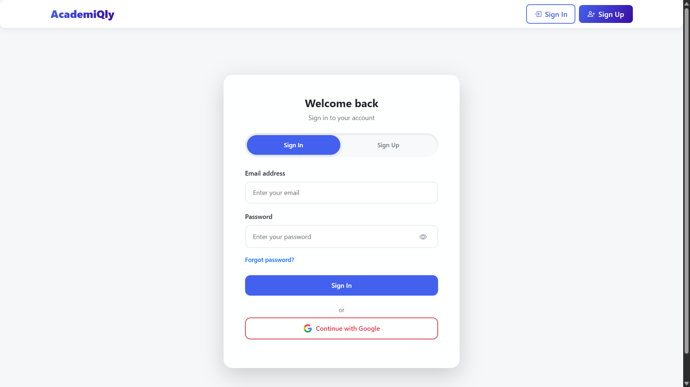
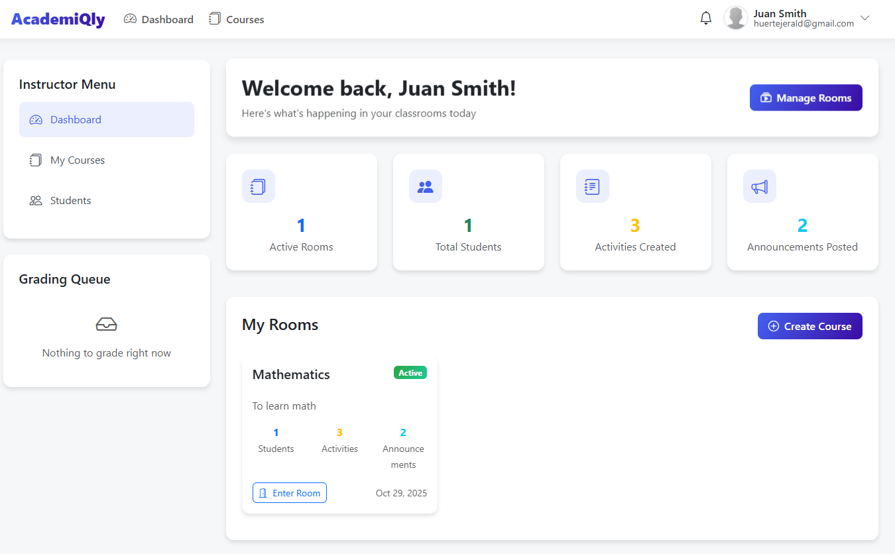
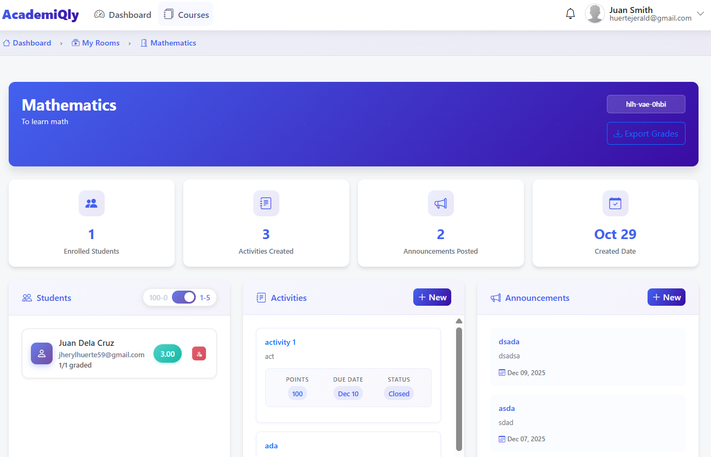
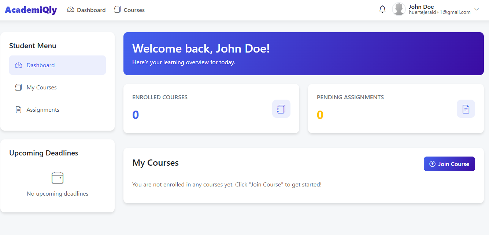

<div align="center">

# AcademiQly

[](#)
[](#)
[](#)
[](#)

**A web-based system designed to provide students and teachers with real-time calculation of overall subject grades.**

<a href="https://github.com/Huerte/AcademiQly/issues">Report Bug</a> · <a href="https://github.com/Huerte/AcademiQly/issues">Request Feature</a>

</div>

---

## Table of Contents

- [Demo](#demo)
- [Features](#features)
- [Installation Guidance](#installation-guide)
- [Usage](#usage)
- [Project Structure](#project-structure)
- [Configuration](#configuration)
- [Contributing](#contributing)
- [License](#license)

---

## Demo

> Visual overview of the AcademiQly platform.

### Public Intro Page


### Authentication


### Teacher Dashboard



### Student Dashboard


_This project runs as a web environment. See [Usage](#usage) for expected interactions._

---

## Features

AcademiQly provides a web-based dashboard designed for real-time subject grade calculation.  
Built to be efficient, accessible, and user-friendly for both teachers and students.

- **Real-Time Calculation:** Provides an overall view of student grades dynamically.
- **Role-Based Access:** Dashboards tailored specifically to teachers and students.
- **Public Intro Page:** A welcoming public-facing first page that serves as an introduction to the platform for new users.
- **Database Integration:** Securely maintains academic records via SQLite/PostgreSQL.

---

## Installation Guide

Follow these steps to install AcademiQly locally.

### Prerequisites

- **Python 3.10+**
- **pip (Python Package Manager)**
- **PostgreSQL / SQLite**

---

### Step 1: Get the Code

```bash
git clone https://github.com/Huerte/AcademiQly.git
cd AcademiQly
```

---

### Step 2: Install Dependencies

```bash
pip install -r src/requirements.txt
```

---

### Step 3: Database & Migration

```bash
cd src
python manage.py makemigrations
python manage.py migrate
```

---

### Step 4: Run the Server

```bash
python manage.py runserver
```

---

## Usage

1. Open your browser and navigate to `http://127.0.0.1:8000/`.
2. Login as a Teacher or Student.
3. Use the dashboard to input grades and view automatically calculated overall subject grades.
4. Export or generate necessary academic reports.

---

## Project Structure

```
AcademiQly/
│
├── src/                    # Core Django Logic
│   ├── core/               # Base logic and settings
│   ├── main/               # Main application and views
│   ├── dashboard/          # Dashboard specific application
│   ├── user/               # User authentication & role management
│   ├── room/               # Subject or classroom application
│   ├── static/             # Static resources (CSS, JS, Images)
│   ├── templates/          # HTML Templates
│   ├── manage.py           # Django startup script
│   └── requirements.txt    # Project Python dependencies
└── README.md
```

---

## Configuration

Edit the environment configuration file using the provided `.env` format:

```bash
AcademiQly/.env
```

| Key | Type | Default | Description |
|-----|------|---------|-------------|
| `SECRET_KEY` | `string` | `-` | Django secret key for cryptographic signing. |
| `DEBUG` | `boolean` | `True` | Toggles development mode on/off. |
| `DATABASE_URL` | `string` | `sqlite:///db.sqlite3` | Connection URI for your database. |

---

## Contributing

Contributions are welcome and appreciated!

1. Fork the Project
2. Create a Feature Branch (`git checkout -b feature/AmazingFeature`)
3. Commit Changes (`git commit -m 'Add AmazingFeature'`)
4. Push to Branch (`git push origin feature/AmazingFeature`)
5. Open a Pull Request

---

## License

Distributed under the **MIT** License. See [`LICENSE`](LICENSE) for details.

---

<div align="center">

&copy; 2026 [Huerte](https://github.com/Huerte). All Rights Reserved.

</div>
